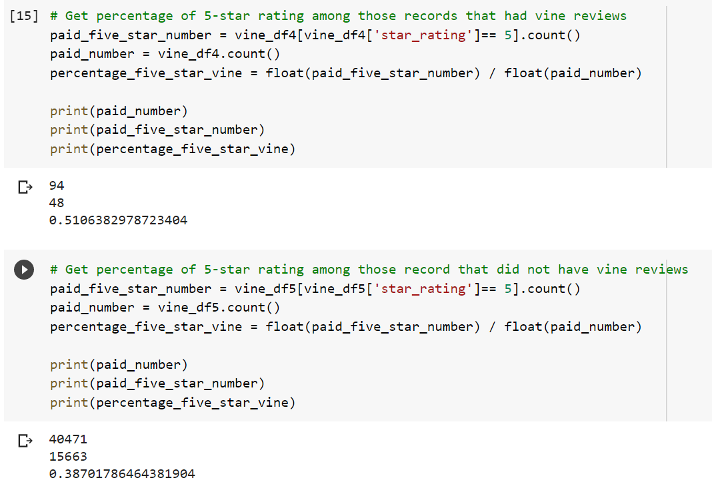

# Big_Data
## Project Summary
In this project, the tools we used to analyze data are Spark and Amazon Web Services. I chose the video games dataset and perfomed data extraction, data transformation and data summarization using ETL in Google Colab. Also, the final data was loaded into tables in Postgres.Later, I determined if vine reviews ae biased by performing multiple statistical analysis. The results are shown below.

## Findings
51.06% percent of 5-star among those records have vine reviews
 38.7% percent of 5-star rating among those records do not have vine reviews.
